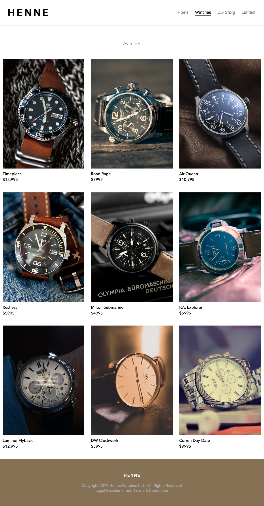

# website-flexbox
This is a one page webpage I created for learning purposes. It uses Flexbox on the `header` and CSS Grid on the `main` section.

That's how the webpage looks like:

## Articles
I wrote 2 articles on Flexbox:

1. [Flexbox: Getting started (Part 1/2)](https://medium.com/@maret.idris/flexbox-getting-started-part-1-2-2e101815d405)
Fun places to learn Flexbox.
2. [Flexbox: Building a navigation bar (Part 2/2)](https://medium.com/@maret.idris/flexbox-building-a-navigation-part-2-2-6cc58b9d4173)
Breakdown of a navigation bar I built using Flexbox.

## Images
Here is a list of the owners of all of the watch images. 

[Watch 1 by Evran Jawad](https://unsplash.com/photos/61Sx5d21JVA)

[Watch 2 by Sebastien Wiertz](https://www.flickr.com/photos/wiertz/7388984844/in/faves-156058565@N07/)

[Watch 3 by Otis Blank](https://www.flickr.com/photos/dryheatpanzer/8258731309/in/album-72157622029639013/)

[Watch 4 by Tommy Fjordbøge](https://www.flickr.com/photos/hamsteren/6072878210/in/faves-156058565@N07/)

[Watch 5 by Franck J.](https://www.flickr.com/photos/technewatches/16636290326/in/faves-156058565@N07/)

[Watch 6 by Dmitry Nucky Thompson](https://unsplash.com/photos/ccncRDICVNk)

[Watch 7 by j0hnnycache](https://www.flickr.com/photos/27617247@N03/15292446602/in/faves-156058565@N07/)

[Watch 8 by Ricky Kharawala](https://unsplash.com/photos/Yka2yhGJwjc)

[Watch 9 by farin sadiq](https://unsplash.com/photos/sRl0OW4XFYg)
